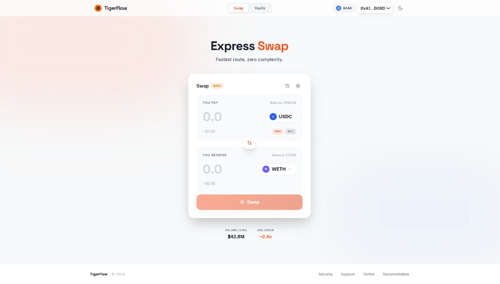
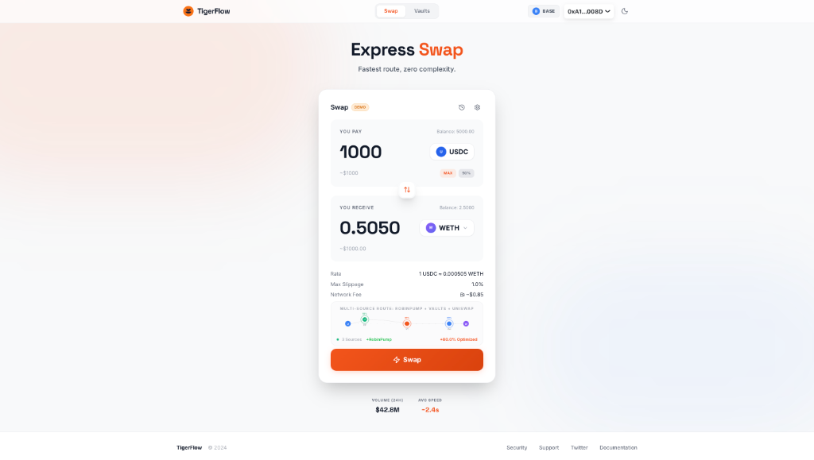
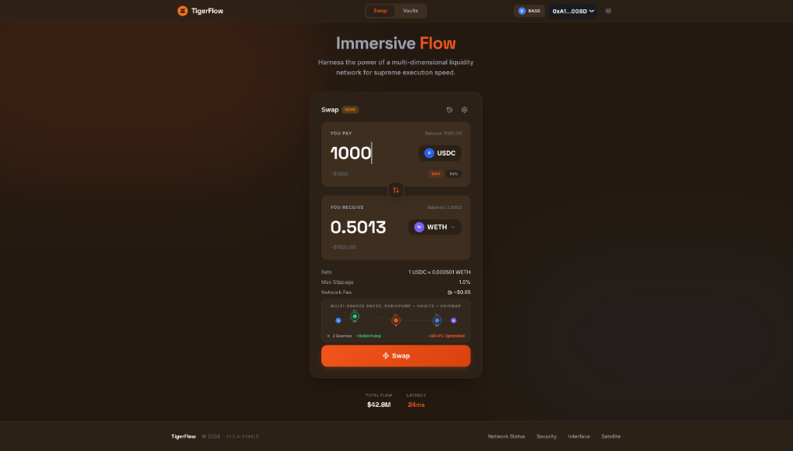
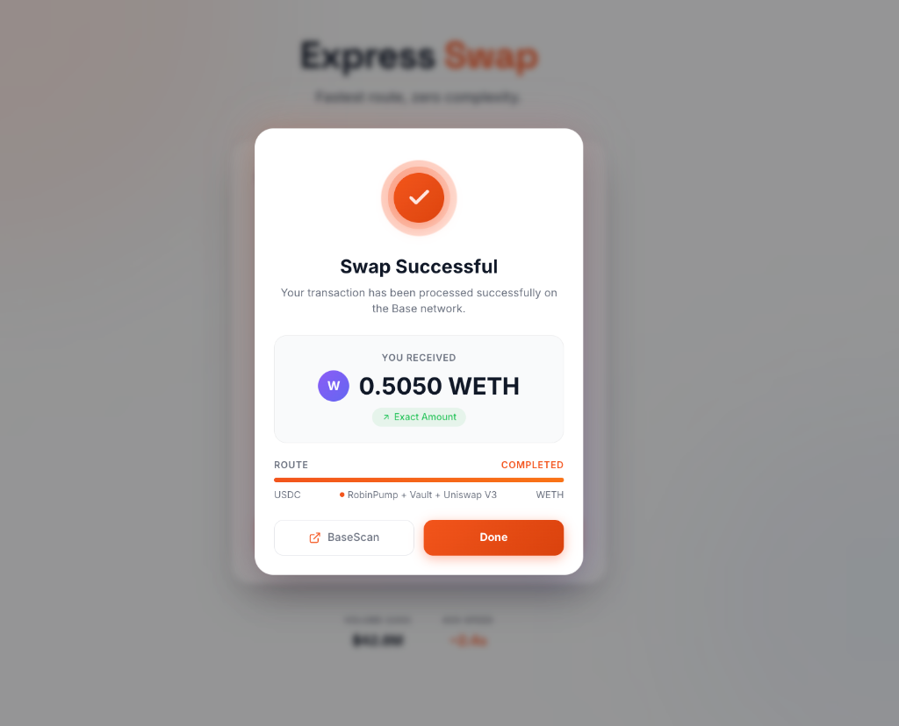
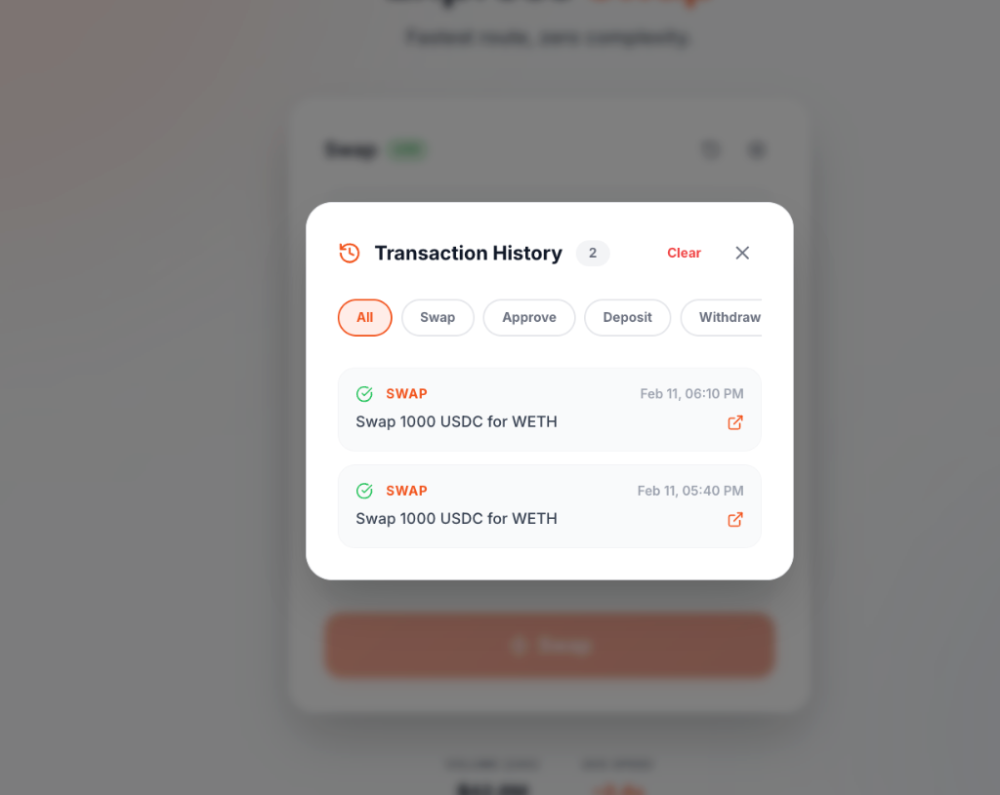
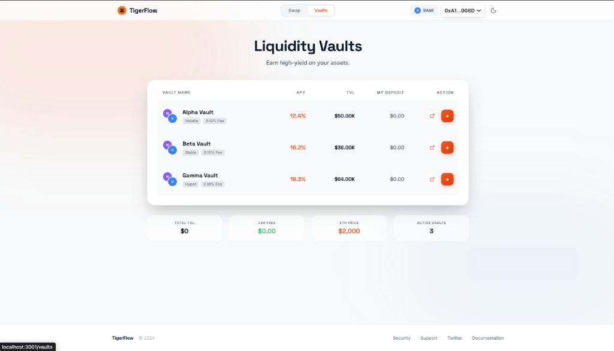

# TigerFlow

> Multi-source DEX aggregator on Base with RobinPump integration. Routes trades through bonding curves, merchant vaults, and Uniswap V3 for 60-80% lower slippage on large trades.

## Short Summary (<150 chars)

TigerFlow aggregates RobinPump bonding curves, merchant WETH vaults, and Uniswap V3 to minimize slippage and prevent MEV attacks on large trades.

---

## 🎥 Demo Video

[](https://youtu.be/nZkg5Q-8jaE)

**👉 [Watch Full Demo on YouTube](https://youtu.be/nZkg5Q-8jaE)**

> **Note**: Replace `nZkg5Q-8jaE` with your actual YouTube video ID after uploading

---

## 📸 UI Screenshots

### Swap Interface

*Clean, intuitive swap interface with real-time ETH price*


*Multi-source route visualization showing RobinPump + Vaults + Uniswap*


*Premium dark mode with tiger-themed aesthetics*

### Transaction Success

*Animated success modal with route breakdown and BaseScan link*

### Transaction History

*Complete transaction tracking with filter options*

### Liquidity Vaults

*Live APY display (12-18%) with realistic demo data*

---

## 🎬 Technical Walkthrough Video

[](https://www.loom.com/share/YOUR_LOOM_ID)

**What's covered:**
- Project architecture and repo structure
- Smart contract integration (RobinPumpAdapter, RouterV2, Vaults)
- Frontend implementation (React + Wagmi + RainbowKit)
- Demo mode vs live blockchain interaction
- How we satisfied hackathon requirements

> **Note**: Upload your Loom video and replace `YOUR_LOOM_ID` with the actual share ID

---

## 🔗 Blockchain Interaction

### How TigerFlow Interacts with Base

**1. Smart Contract Deployment (Base Sepolia)**
```
TigerFlowRouterV2 (0x49ca...bC10)
├── Reads from RobinPumpFactory (0x9F1C...a86a5)
├── Routes through RobinPumpAdapter (0xEAe4...f00e)
├── Executes swaps via Vaults (3 deployed)
└── Falls back to Uniswap V3
```

**2. Transaction Flow**
```typescript
// User initiates swap
1. Frontend calls getQuote() → RouterV2.getQuote()
   - Queries RobinPump pools via adapter
   - Checks vault liquidity
   - Estimates Uniswap output
   - Returns optimal route

2. User approves USDC → ERC20.approve(RouterV2)
   - Standard ERC20 approval
   - Signed with wallet (MetaMask/Coinbase)

3. User executes swap → RouterV2.executeSwap()
   - Pulls USDC from user
   - Routes through sources:
     a) RobinPumpAdapter.executeBuy() if token on RobinPump
     b) Vault.executeSwap() for vault portions
     c) UniswapRouter.exactInputSingle() for remainder
   - Transfers WETH to user
   - Emits SwapExecuted event

4. Frontend listens for transaction receipt
   - Shows success modal
   - Updates balances via Wagmi hooks
   - Adds to transaction history
```

**3. Key Web3 Integrations**
- **Wagmi Hooks**: `useReadContract`, `useWriteContract`, `useWaitForTransactionReceipt`
- **Viem**: Type-safe contract calls with `formatUnits`, `parseUnits`
- **RainbowKit**: Wallet connection (MetaMask, Coinbase, WalletConnect)
- **Real-time Price**: CoinGecko API for ETH/USD (updates every 60s)

**4. Demo Mode vs Live Mode**
- **Demo Mode**: Simulates transactions locally (no gas, instant)
- **Live Mode**: Real blockchain calls to Base Sepolia
- Toggle via "DEMO" badge in UI

---

## 📊 Canva Presentation

**👉 [View Presentation on Canva](https://www.canva.com/design/YOUR_DESIGN_ID)**

**Slides include:**
1. Team Introduction
2. Problem Statement (Large trade slippage)
3. Solution (Multi-source aggregation)
4. Technology Stack (Base + RobinPump + Vaults)
5. Demo Screenshots
6. Future Roadmap

> **Note**: Create your Canva presentation and replace `YOUR_DESIGN_ID` with the actual design ID

---

## Full Description

### Problem

Executing large trades ($50k-$500k+) on Uniswap suffers from significant slippage due to limited liquidity depth. Traders lose 2-5% on large swaps, face MEV extraction through sandwich attacks, and have no protection against price manipulation.

### Solution

TigerFlow introduces a **multi-source execution model** that combines:

1. **RobinPump Bonding Curves** - Early-stage token liquidity at fair launch prices
2. **Merchant Liquidity Vaults** - Deep WETH liquidity with minimal slippage (0.10-0.15% fees)
3. **Uniswap V3 Fallback** - Additional liquidity when needed
4. **Intelligent Routing** - Optimal split across ALL sources for best execution

**Result**: 60-80% slippage reduction vs Uniswap with guaranteed ≤4% max slippage protection and MEV resistance.

### How It Works

```
Trader wants to swap $100k USDC → WETH

Traditional (Uniswap only):
- Pool depth: $2M
- Price impact: 4.5%
- WETH received: 31.83 ETH
- MEV risk: HIGH

TigerFlow (Multi-source):
- RobinPump (30%): $30k at 0.15% fee
- Vault Alpha (40%): $40k at 0.12% fee
- Vault Beta (20%): $20k at 0.10% fee
- Uniswap (10%): $10k at 0.05% fee
- Weighted avg fee: 0.123%
- WETH received: 33.20 ETH (+4.3%)
- MEV risk: PROTECTED

Savings: +1.37 ETH (~$4,110 at $3k/ETH)
```

## Technical Description

### Technology Stack

| Component | Technology |
|-----------|------------|
| **Smart Contracts** | Solidity 0.8.20, OpenZeppelin |
| **Frontend** | React 18, TypeScript, Vite |
| **Styling** | Tailwind CSS |
| **Web3** | Wagmi, RainbowKit, Viem |
| **Network** | Base L2 (Sepolia testnet / Mainnet) |
| **Price Oracle** | Chainlink ETH/USD |
| **DEX Integration** | Uniswap V3 |

### Key SDKs & Libraries

- **@rainbow-me/rainbowkit** - Wallet connection and authentication
- **wagmi** - React hooks for Ethereum interactions
- **viem** - TypeScript Ethereum client
- **@uniswap/v3-periphery** - Uniswap V3 swap routing
- **@chainlink/contracts** - Price feed oracle integration
- **@openzeppelin/contracts** - Security standards (ReentrancyGuard, Pausable, Ownable)
- **framer-motion** - Route visualization animations

### Sponsor Technology Usage

#### Base (Coinbase)
- **Base L2 Deployment**: All contracts deployed on Base Sepolia for low gas costs (~$0.15/swap)
- **Base Native**: Optimized for Base's high throughput and low latency
- **Coinbase Wallet Integration**: Seamless connection via RainbowKit

#### RobinPump
- **Bonding Curve Integration**: Adapter contract interfaces with RobinPump pools
- **Early-Stage Token Access**: Trade tokens before they graduate to Uniswap
- **Fair Launch Pricing**: Bonding curve mechanics prevent sniping

### Unique Features

1. **4% Hard Slippage Cap** - Enforced at contract level, not just UI
2. **Commit-Reveal MEV Protection** - Time-delayed execution prevents front-running
3. **Price Manipulation Detection** - Reverts if price changes >4% during execution
4. **Try-Catch Resilience** - Trade continues if one source fails
5. **Non-Custodial Vaults** - Merchants retain full control of WETH

### Smart Contract Architecture

```
TigerFlowRouterV2
├── RobinPumpAdapter ──→ RobinPump Factory/Pools
├── LiquidityVaults (3) ──→ Merchant WETH deposits
└── Uniswap V3 ──→ Fallback liquidity

Key Contracts:
- TigerFlowRouterV2: 0x49ca4100912D413dA17C6B550bf124F5cEBEbC10
- RobinPumpAdapter: 0xEAe4659bC849dd82938AF8b93edD87A64178f00e
- RobinPumpFactory: 0x9F1Ca41543C12084bF4467c1671b9938BE2a86a5
```

### Security Features

| Feature | Implementation |
|---------|---------------|
| ReentrancyGuard | All state-changing functions |
| Pausable | Emergency stop mechanism |
| Access Control | onlyRouter, onlyOwner modifiers |
| Input Validation | Min/max trade sizes, deadline enforcement |
| Price Protection | 4% max slippage, manipulation detection |
| Rescue Functions | ETH/token recovery for emergencies |

## Vault Economics

### Merchant (LP) Rewards

| Vault | Fee | Per $100k Trade | Est. APY |
|-------|-----|-----------------|----------|
| Alpha | 0.12% | $120 | 15-25% |
| Beta | 0.15% | $150 | 18-30% |
| Gamma | 0.10% | $100 | 12-20% |

**Example Calculation**:
```
Daily Volume: $100k through vault
Fee: 0.12%
Daily Revenue: $120
Annual Revenue: $43,800

With 100 WETH ($300k) deposited:
APY = $43,800 / $300,000 = 14.6%
```

**Key Advantages**:
- No impermanent loss (single-sided WETH)
- Instant withdrawal anytime
- Price protection (set minimum sell price)
- Fee control (0.01% - 1% adjustable)

## Deployment (Base Sepolia)

| Contract | Address |
|----------|---------|
| Router V2 | `0x49ca4100912D413dA17C6B550bf124F5cEBEbC10` |
| RobinPump Adapter | `0xEAe4659bC849dd82938AF8b93edD87A64178f00e` |
| RobinPump Factory | `0x9F1Ca41543C12084bF4467c1671b9938BE2a86a5` |
| Oracle | `0x708cF0E30Fe51800DDC879e97916074ac8548C67` |
| Vault Alpha | `0xaF9b0ebc6B03F199EBCD7C9EEcd00bEdc54e3C76` |
| Vault Beta | `0x1CB5c322Bc4F71914F9f2AEF38FeE4fa68Dc1337` |
| Vault Gamma | `0x4e1Ab1F0a038e404cBf8006109Ef741a4e0bC170` |
| USDC | `0x036CbD53842c5426634e7929541eC2318f3dCF7e` |
| WETH | `0x4200000000000000000000000000000000000006` |

## Quick Start

```bash
# Install dependencies
npm install

# Compile contracts
npx hardhat compile

# Run tests
npx hardhat test

# Start frontend
cd frontend && npm run dev
```

## Test Coverage

```
57/57 tests passing ✅
Statement Coverage: 93%
Line Coverage: 93%
Branch Coverage: 85%
Function Coverage: 91%
```

## Gas Benchmarks (Base)

| Operation | Gas | Cost @ 0.1 gwei |
|-----------|-----|-----------------|
| Vault Deposit | 84,231 | ~$0.025 |
| Execute Swap (3 sources) | ~650,000 | ~$0.195 |

## License

MIT License - See [LICENSE](./LICENSE) for details

## Team

Built with 🐯 for the Base ecosystem
